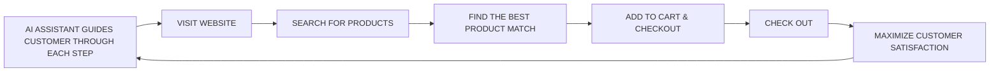

Gigalogy logo

HOME PRODUCT COMPANY NEWS REQUEST DEMO

# Personalizer: Omnichannel Personalization for E-Commerce Businesses

Using our state-of-the-art AI engine, we transform E-Commerce businesses by enhancing product discovery, user engagement, revenue growth, and LTV.

[GET STARTED] [USE CASES]

| Introducing Gigalogy Personalizer |
|-----------------------------------|
| [Video thumbnail with play button] |
| INTRODUCING GIGALOGY PERSONALIZER |
| Watch on YouTube                  |

## Key Features

| Laptop showing product icons | 1. Personalized Search Results |
|----------------------------------------------|--------------------------------|
|                                              | Guide consumers towards the products they seek or suggests alternatives that might pique their interest. |
|                                              | 2. Real-time Product Recommendation |
|                                              | Understands consumer's style, offers suggestions that complement their search and enhance their shopping experience |
|                                              | 3. Generative AI powered Advisor |
|                                              | Ever-present confidant, ready to address any inquiries, provide valuable advice, and ensure a smooth journey to checkout |

## Solution List

We have designed and developed solutions focusing on each steps of the user journey.

| GPT enabled advisor assistant icon | Recommend based on search history icon | Dynamic Pricing icon |
|-----------------------------------------------------|--------------------------------------------------------|---------------------------------------|
| GPT enabled advisor assistant                       | Recommend based on search history                      | Dynamic Pricing                       |

---
# customer support bot

## User Journey

From the moment a consumer comes to your store until they check out each step of their journey is personalized to ensure they find the right products at the right moment. Whenever a consumer is stuck at any stage or wants to know more about a certain product they can talk to our Generative AI-powered Advisor that guides them to what they are looking for.

## How It Works

| Ease of Integration | Time to Value | Omni-Channel |
|---------------------|----------------|--------------|
| No technical knowledge required. Completely customizable with powerful API | Integration within a day and start getting results within a week | Omni-channel experience with 1st party data |

[Learn More] [Learn More] [Learn More]

[START] [Gear Icon] [Cog Icon] [Rocket Icon] [Target Icon]
---
| CREATE A PROJECT | INTEGRATE DATA SOURCE | TRAIN | PUBLISH | ENJOY |
|-------------------|------------------------|-------|---------|-------|

## Unique Value Proposition

Search, Recommendation, Conversation, Promotion: All in one Generative AI powered platform

| SEARCH | RECOMMENDATION | CHAT | PROMOTION |
|--------|----------------|------|------------|
| [Icon of person using search interface] | [Icon of person at desk with recommendation interface] | [Icon of person using chat on mobile device] | [Icon of person with megaphone and mobile interface] |

## Value Customer Receives

| 50% | 20% | 3x |
|-----|-----|-----|
| CTR Improvement | Increased Revenue | Repeat Users |

| DISCOVERY | FULFILLMENT | RETENTION |
|-----------|-------------|-----------|

## Industry We Support

We have empowered businesses in fashion, beauty, beverage and travel industry where the consumption cycle is shorter and consumer's preference changes with time.

| FASHION | BEAUTY | BEVERAGE | TRAVEL |
|---------|--------|----------|--------|
| [Icon of clothing rack] | [Icon of perfume bottle] | [Icon of various drinks] | [Icon of luggage and travel items] |
---
Curious to hear more? Join us in revolutionizing the E-
Commerce experience. Maximize your consumer
satisfaction and brand loyalty with Gigalogy Personalizer.

[GET STARTED]

| PRODUCT     | COMPANY         | PRESS & CONTACT | RESOURCES       |
|-------------|-----------------|-----------------|-----------------|
| Personalizer| Corporate Profile| Request Demo    | For Developers  |
| Maira       | Our Mission     | Press Room      | Partner Program |
| G-Core      | Our Team        | Events          | Sandbox         |
| SmartAds    | Careers         | Experience Box  | Documentation   |
|             |                 |                 | Tutorial        |

© 2024 Gigalogy Inc. Privacy Policy Terms and Conditions Cookie Policy Commercial Disclosure

[Social media icons for LinkedIn, Twitter, and Facebook]

[Chat icon]