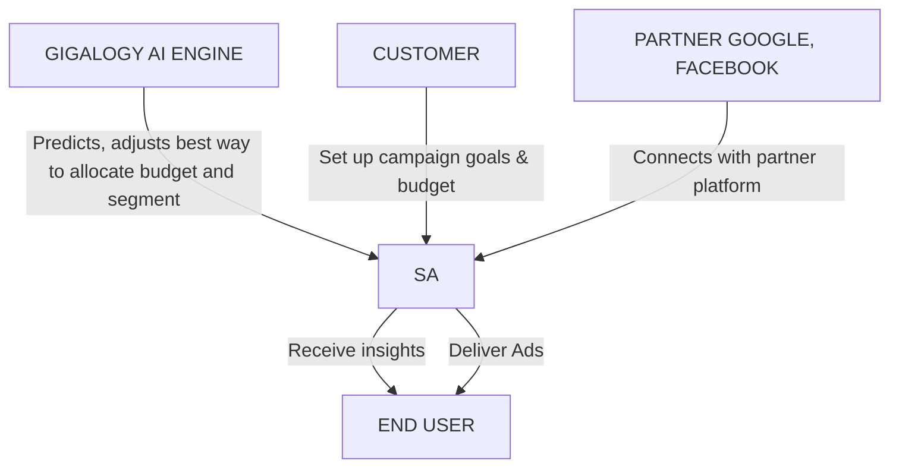

Gigalogy logo

HOME PRODUCT COMPANY NEWS REQUEST DEMO

# AI-Driven Programmatic Advertising Management Platform

SmartAds is a programmatic advertising management platform that uses Artificial Intelligence to predict the optimum way of setting up digital campaigns, adjusting budget, measuring performance cross-platform in real-time and ensures optimum ROAS with transparency.

[REQUEST A DEMO] [USE CASES]

## Key Features Of SmartAds

| Feature | Description |
|---------|-------------|
| Clock icon | Predict the optimum budget for a specific platform / segment real time based on your campaign goals |
| Lightbulb icon | Predict likelihood of user engaging to a creative element / ad |
| Graph icon | Real time reporting |
| Magnifying glass icon | Complete transparency on each stage of campaign management |

## Why SmartAds ?
---
| Support With Multiple Goal Settings | AI Based Daily Budget Prediction | Cross Platform Real-Time Reporting |
|:---:|:---:|:---:|
| Laptop showing multiple goal settings interface | Laptop showing budget prediction graph | Laptop showing real-time reporting dashboard |

1. SETUP GOALS & BUDGET
2. DISTRIBUTE THE BUDGET ON DIFFERENT PLATFORMS
3. RUN THE CAMPAIGNS ON DIFFERENT PLATFORMS
4. GATHER ANALYTICS & MEASURE PERFORMANCES

## How SmartAds Works?

## The value customers receive

| Zero human error | Campaign management cost decreased | Transparent performance measurement according to the goals |
|:---:|:---:|:---:|
| 0% | 90% | 100% |
---
# Supported Platform

| Google | theTradeDesk | facebook | YouTube |
|--------|--------------|----------|---------|
| Instagram | MediaMath | X | SmartNews |
| CyberAgent | LINE | TikTok | Yahoo! |

Are you ready to start
building applications with
greater value?

[REQUEST A DEMO] [USE CASES]

[An illustration showing people working with a large screen displaying charts and gears, representing application development and data analysis]

| PRODUCT | COMPANY | PRESS & CONTACT | RESOURCES |
|---------|---------|-----------------|-----------|
| Personalizer | Corporate Profile | Request Demo | For Developers |
| Maira | Our Mission | Press Room | Partner Program |
| G-Core | Our Team | Events | Sandbox |
| SmartAds | Careers | Experience Box | Documentation |
| | | | Tutorial |

© 2024 Gigalogy Inc. Privacy Policy Terms and Conditions Cookie Policy Commercial Disclosure

[Social media icons: LinkedIn, Twitter, Facebook]